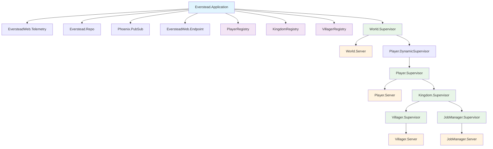
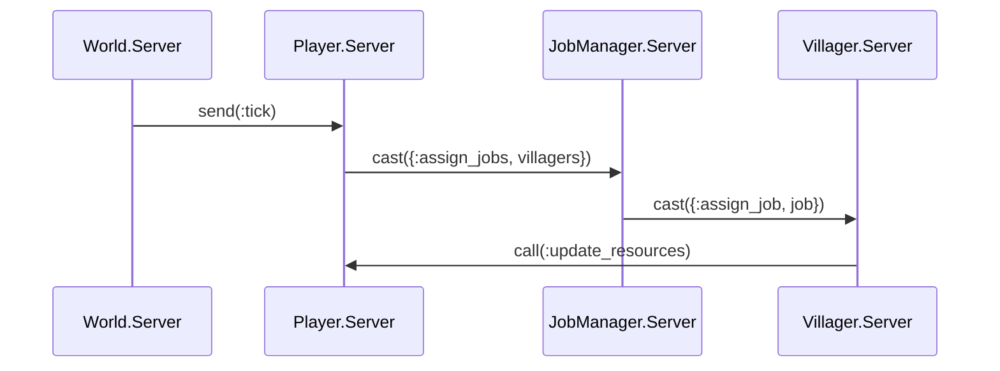
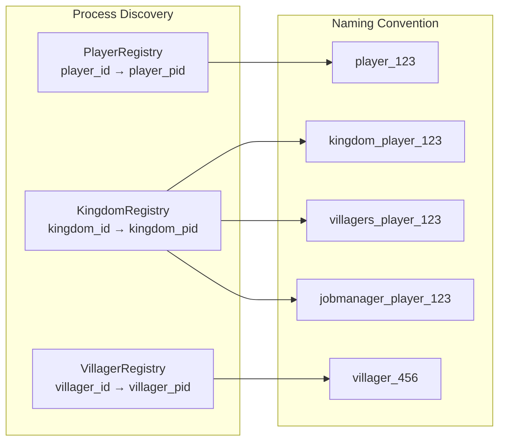
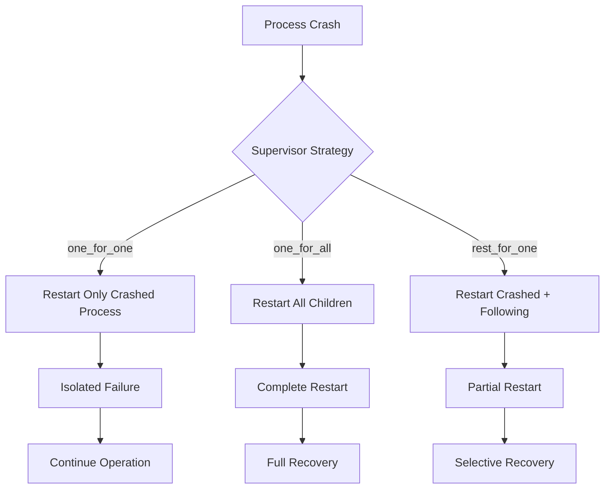

# Architecture

## OTP Supervision Tree

```mermaid
graph TB
    App[Everstead.Application]
    App --> Telemetry[EversteadWeb.Telemetry]
    App --> Repo[Everstead.Repo]
    App --> PubSub[Phoenix.PubSub]
    App --> Endpoint[EversteadWeb.Endpoint]
    App --> PlayerReg[PlayerRegistry]
    App --> KingdomReg[KingdomRegistry]
    App --> VillagerReg[VillagerRegistry]
    App --> WorldSup[World.Supervisor]
    
    WorldSup --> WorldServer[World.Server]
    WorldSup --> PlayerDynSup[Player.DynamicSupervisor]
    
    PlayerDynSup --> PlayerSup[Player.Supervisor]
    PlayerSup --> PlayerServer[Player.Server]
    PlayerSup --> KingdomSup[Kingdom.Supervisor]
    
    KingdomSup --> VillagerSup[Villager.Supervisor]
    KingdomSup --> JobManagerSup[JobManager.Supervisor]
    
    VillagerSup --> VillagerServer[Villager.Server]
    JobManagerSup --> JobManagerServer[JobManager.Server]
    
    classDef application fill:#e1f5fe
    classDef registry fill:#f3e5f5
    classDef supervisor fill:#e8f5e8
    classDef server fill:#fff3e0
    
    class App application
    class PlayerReg,KingdomReg,VillagerReg registry
    class WorldSup,PlayerSup,KingdomSup,VillagerSup,JobManagerSup supervisor
    class WorldServer,PlayerServer,VillagerServer,JobManagerServer server
```

## Process Communication

```mermaid
sequenceDiagram
    participant WS as World.Server
    participant PS as Player.Server
    participant JMS as JobManager.Server
    participant VS as Villager.Server
    
    WS->>PS: send(:tick)
    PS->>JMS: cast({:assign_jobs, villagers})
    JMS->>VS: cast({:assign_job, job})
    VS->>PS: call(:update_resources)
```

## Registry Architecture

```mermaid
graph LR
    subgraph "Process Discovery"
        PR[PlayerRegistry<br/>player_id → player_pid]
        KR[KingdomRegistry<br/>kingdom_id → kingdom_pid]
        VR[VillagerRegistry<br/>villager_id → villager_pid]
    end
    
    subgraph "Naming Convention"
        PR --> P1[player_123]
        KR --> K1[kingdom_player_123]
        KR --> K2[villagers_player_123]
        KR --> K3[jobmanager_player_123]
        VR --> V1[villager_456]
    end
```

## Error Handling

```mermaid
graph TD
    A[Process Crash] --> B{Supervisor Strategy}
    B -->|one_for_one| C[Restart Only Crashed Process]
    B -->|one_for_all| D[Restart All Children]
    B -->|rest_for_one| E[Restart Crashed + Following]
    
    C --> F[Isolated Failure]
    D --> G[Complete Restart]
    E --> H[Partial Restart]
    
    F --> I[Continue Operation]
    G --> J[Full Recovery]
    H --> K[Selective Recovery]
```
