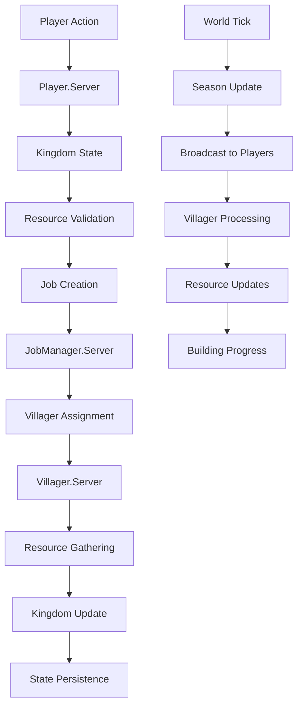
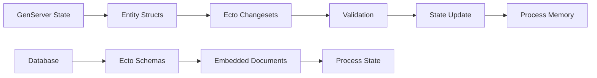
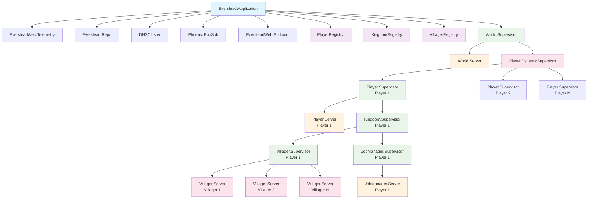
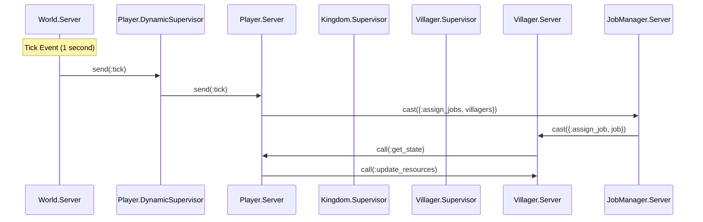
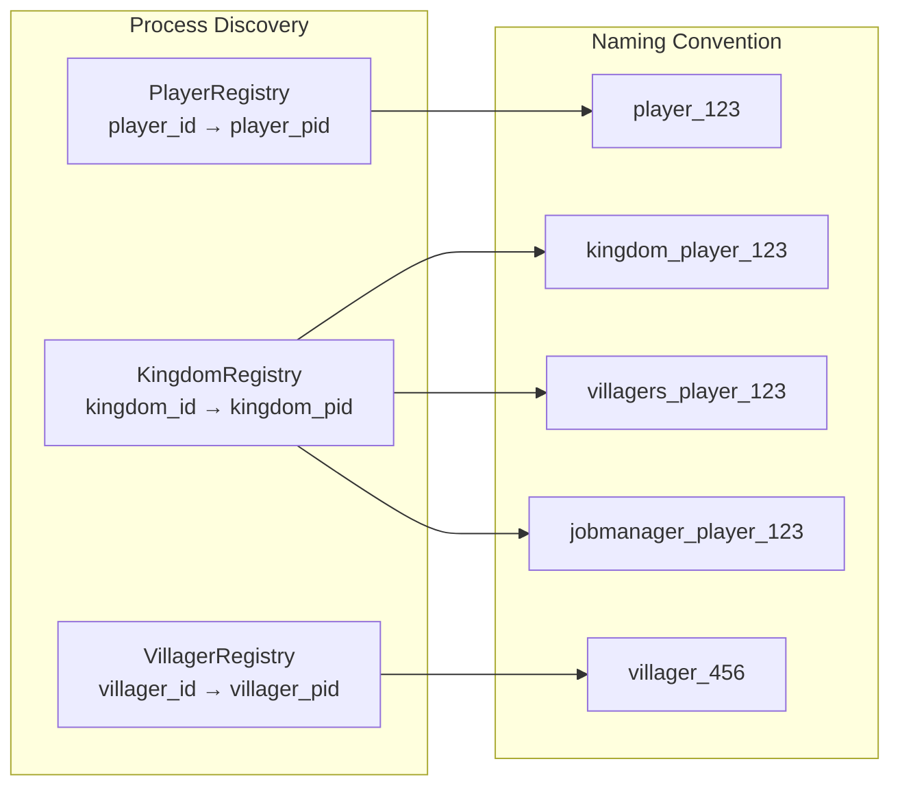
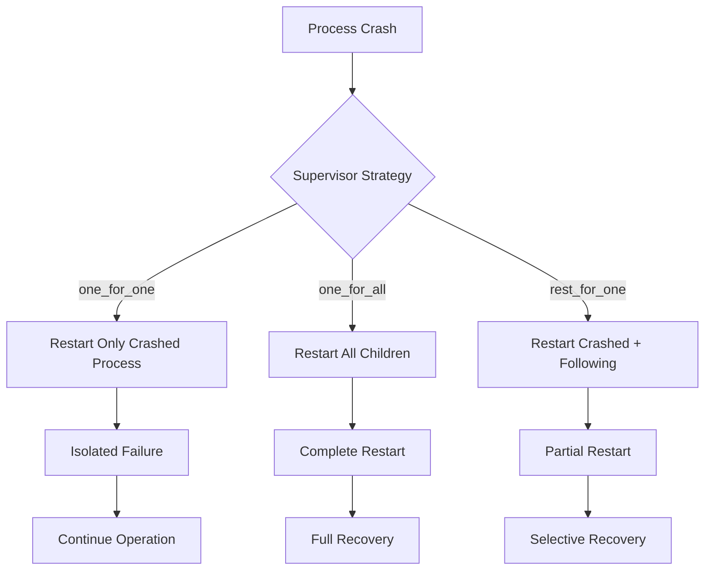
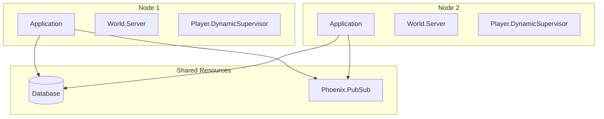

# Everstead Architecture Documentation

This document provides a comprehensive overview of the Everstead system architecture, focusing on the OTP supervision tree, process communication patterns, data modeling, and system design decisions.

## Table of Contents

1. [System Overview](#system-overview)
2. [Data Modeling](#data-modeling)
3. [OTP Supervision Tree](#otp-supervision-tree)
4. [Process Communication](#process-communication)
5. [Registry Architecture](#registry-architecture)
6. [Error Handling Strategy](#error-handling-strategy)
7. [Scalability Considerations](#scalability-considerations)
8. [Performance Characteristics](#performance-characteristics)

## System Overview

Everstead is a kingdom simulation game built using Elixir/OTP principles. The system is designed around the concept of isolated player kingdoms, each containing villagers, buildings, and resources that evolve over time through a tick-based simulation.

### Core Design Principles

- **Process Isolation**: Each player's kingdom runs in its own supervision tree
- **Fault Tolerance**: Process crashes are contained within their supervision boundaries
- **Scalability**: Horizontal scaling through independent player processes
- **Real-time Simulation**: Tick-based updates every second
- **Event-driven Architecture**: Asynchronous communication between processes

## Data Modeling

The Everstead system uses a hierarchical data model with embedded schemas for efficient data management and process isolation. The following Mermaid diagram shows the complete data structure:

```mermaid
erDiagram
    %% Core Entities
    Player {
        binary_id id PK
        string name
        Kingdom kingdom "embeds_one"
    }
    
    World {
        integer width
        integer height
        map tiles
        integer day
        Season season "embeds_one"
    }
    
    Kingdom {
        binary_id id PK
        string name
        list Villager villagers "embeds_many"
        list Building buildings "embeds_many"
        list Resource resources "embeds_many"
    }
    
    %% World Components
    Season {
        atom current "spring|summer|fall|winter"
        integer ticks_elapsed
        integer year
    }
    
    Tile {
        atom terrain "grass|forest|water|mountain"
        string building_id FK
        Resource resource "embeds_one"
    }
    
    Resource {
        atom type "wood|stone|food"
        integer amount
        map location
    }
    
    %% Kingdom Components
    Villager {
        binary_id id PK
        string name
        atom state "idle|working|moving|resting"
        atom profession "builder|farmer|miner"
        map location
        map inventory
    }
    
    Building {
        binary_id id PK
        atom type "house|farm|lumberyard|storage"
        map location
        integer construction_progress
        integer hp
    }
    
    Job {
        binary_id id PK
        atom type "build|gather|move"
        atom status "pending|in_progress|done"
        map target
        string assigned_villager_id FK
    }
    
    %% Relationships
    Player ||--o| Kingdom : "owns"
    World ||--o| Season : "has"
    World ||--o{ Tile : "contains"
    Kingdom ||--o{ Villager : "employs"
    Kingdom ||--o{ Building : "contains"
    Kingdom ||--o{ Resource : "stores"
    Tile ||--o| Resource : "may_contain"
    Villager ||--o{ Job : "assigned_to"
    Building ||--o| Job : "construction_job"
```

### Data Model Explanation

#### **Core Entities**

**Player**
- Root entity representing a game player
- Contains a single Kingdom (one-to-one relationship)
- Minimal state to enable process isolation

**World**
- Global simulation state
- Contains tile grid and seasonal information
- Shared across all players for consistency

**Kingdom**
- Player's individual game state
- Contains all player-specific entities
- Isolated from other players

#### **World Components**

**Season**
- Tracks time progression (spring → summer → fall → winter)
- Affects resource gathering rates and building construction
- Global state shared by all players

**Tile**
- Individual world grid cells
- Contains terrain type and optional resources
- May reference buildings for construction

**Resource**
- Basic game resources (wood, stone, food)
- Can be located on tiles or in inventories
- Used for building construction and villager maintenance

#### **Kingdom Components**

**Villager**
- Individual worker entities
- Have states (idle, working, moving, resting)
- Can have professions for specialization
- Maintain personal inventories

**Building**
- Constructed structures in the kingdom
- Have construction progress and health points
- Provide various benefits (future feature)

**Job**
- Tasks assigned to villagers
- Have priorities and status tracking
- Can be building, gathering, or movement tasks

### Data Flow Patterns



### Data Validation and Constraints

#### **Entity Validation Rules**

- **Player**: Must have a name, kingdom is optional
- **Kingdom**: Must have a name, all collections default to empty
- **Villager**: Must have a name, state defaults to idle
- **Building**: Must have type and location, construction progress ≥ 0
- **Job**: Must have type and target, status defaults to pending
- **Resource**: Must have type, amount ≥ 0
- **Season**: Must have current season and year > 0

#### **Business Logic Constraints**

- **Resource Availability**: Jobs can only be created if resources are available
- **Villager Capacity**: Kingdom can only support limited number of villagers
- **Building Placement**: Buildings must be placed on valid tiles
- **Job Assignment**: Jobs can only be assigned to idle villagers
- **Seasonal Effects**: Resource gathering rates vary by season

### Data Persistence Strategy

#### **Process State Management**



#### **State Synchronization**

- **In-Memory State**: Primary source of truth during simulation
- **Database Persistence**: Periodic saves for crash recovery
- **Event Sourcing**: Future enhancement for audit trails
- **Process Isolation**: Each player's state is independent

## OTP Supervision Tree

The following Mermaid diagram shows the complete OTP supervision tree structure:



### Supervision Tree Explanation

#### **Application Level**
- **Everstead.Application**: Root supervisor managing all system components
- **Infrastructure**: Telemetry, Database, DNS, PubSub, Web Endpoint
- **Registries**: Three specialized registries for process discovery

#### **World Level**
- **World.Supervisor**: Manages the global simulation state
- **World.Server**: Central tick coordinator (1-second intervals)
- **Player.DynamicSupervisor**: Manages dynamic player creation/removal

#### **Player Level** (Per Player)
- **Player.Supervisor**: Isolates each player's kingdom
- **Player.Server**: Manages player state and resources
- **Kingdom.Supervisor**: Manages kingdom-specific processes

#### **Kingdom Level** (Per Player)
- **Villager.Supervisor**: Dynamic supervisor for villager processes
- **JobManager.Supervisor**: Manages job assignment and tracking

#### **Entity Level** (Per Entity)
- **Villager.Server**: Individual villager AI and state
- **JobManager.Server**: Job queue and assignment logic

## Process Communication

### Communication Patterns



### Message Types

1. **Synchronous Communication** (`GenServer.call/2`)
   - State queries and updates
   - Resource validation
   - Critical operations requiring confirmation

2. **Asynchronous Communication** (`GenServer.cast/2`)
   - Job assignments
   - Resource updates
   - Non-critical operations

3. **Direct Message Passing** (`send/2`)
   - Tick events
   - Emergency notifications
   - Broadcast messages

## Registry Architecture

### Registry Hierarchy



### Registry Usage Patterns

- **PlayerRegistry**: Maps player IDs to player server PIDs
- **KingdomRegistry**: Maps kingdom-related process names to PIDs
  - `kingdom_<player_id>` → Kingdom.Supervisor
  - `villagers_<player_id>` → Villager.Supervisor
  - `jobmanager_<player_id>` → JobManager.Server
- **VillagerRegistry**: Maps villager IDs to villager server PIDs

## Error Handling Strategy

### Supervision Strategies



### Error Recovery Mechanisms

1. **Process Crashes**: Supervisors restart crashed processes
2. **Stale Jobs**: JobManager detects and reassigns orphaned jobs
3. **Resource Validation**: All operations validate resources before execution
4. **Circuit Breakers**: Cross-process communication includes error handling
5. **Graceful Degradation**: System continues operating with reduced functionality

## Scalability Considerations

### Horizontal Scaling



### Performance Characteristics

| Component | Process Count | Memory per Process | Communication Pattern |
|-----------|---------------|-------------------|----------------------|
| World.Server | 1 | ~1KB | Broadcast |
| Player.Server | N (players) | ~5KB | Call/Cast |
| Villager.Server | M (villagers) | ~2KB | Call/Cast |
| JobManager.Server | N (players) | ~3KB | Cast |

### Bottleneck Analysis

1. **World Server**: Single point of failure for tick coordination
2. **Registry Scanning**: O(n) complexity for broadcasting
3. **Memory Growth**: Process proliferation with many villagers
4. **Cross-Process Calls**: Potential latency in job assignment

## Performance Optimizations

### Current Optimizations

- **Process Isolation**: Prevents cascade failures
- **Asynchronous Communication**: Non-blocking operations
- **Registry Caching**: Efficient process discovery
- **Batch Operations**: Grouped villager updates

### Recommended Improvements

1. **Phoenix.PubSub Broadcasting**: Replace Registry.select for broadcasting
2. **Process Pooling**: Group simple villagers into fewer processes
3. **Circuit Breakers**: Add resilience to cross-process communication
4. **Monitoring**: Implement comprehensive telemetry

## Future Architecture Considerations

### Planned Enhancements

1. **Clustering Support**: Multi-node deployment
2. **Process Migration**: Move players between nodes
3. **Advanced Monitoring**: Real-time performance metrics
4. **Event Sourcing**: Audit trail for game state changes

### Modding Architecture

The current architecture supports future modding through:

- **Plugin System**: Add new building types
- **Custom Jobs**: Create new job types
- **Seasonal Events**: Add special seasonal occurrences
- **Resource Types**: Introduce new resource types

---

This architecture provides a solid foundation for a scalable, fault-tolerant kingdom simulation game while maintaining the flexibility to grow and evolve with new features.
