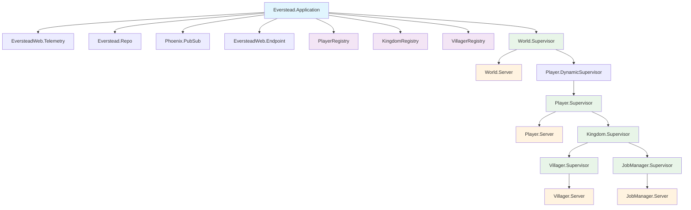
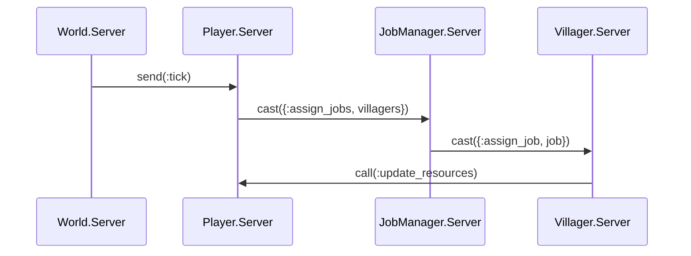

# Architecture

## OTP Supervision Tree

## Process Communication

## Registries

- **PlayerRegistry**: `player_id → player_pid`
- **KingdomRegistry**: `kingdom_id → kingdom_pid`
- **VillagerRegistry**: `villager_id → villager_pid`
